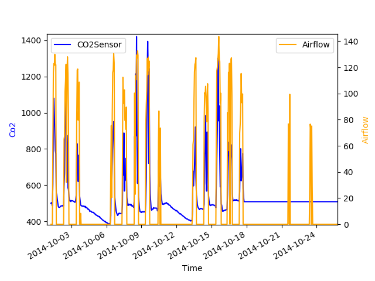

# Portfolio Martijn Bennis

In dit portfolio zijn alle activiteiten te zien die ik heb gedaan tijdens de halfjaar durende minor Applied Data Science (KB74). In deze minor ben ik vooral bezig geweest met het analyseren en toepassen van 'Big data'. Hieronder is de structuur gegeven die zal leiden naar het subkopje waaronder alle opdrachten staan. Wanneer er op de links geklikt wordt zal deze u als lezer naar de desbetreffende pagina leiden. Ik heb de minor als uitdagend, maar leerzaam beschouwd. Ik vond het lastig om mijn draai te vinden binnen het onderzoek omdat ik gewend ben om een opdracht uit te voeren en dit hier helemaal niet het geval was. Tijdens deze minor werd er verwacht dat jij zelf de data verkrijgt en manipuleert tot het gewenste resultaat, zonder een hele duidelijke houvast te hebben. Naarmate het project langer duurde kwam ik steeds makkelijker in het gareel. Ik ben erachter gekomen dat ik Python erg had onderschad in zijn mogelijkheden. Van het 'plotten van grafieken' tot het uitlezen van database kolummen, het is allemaal mogelijk, maar ook erg toegankelijk. Daarnaast heb ik geleerd dat vertrouwen hebben in je mede projectleden essentieel is wanneer je in groepsverband een onderzoek uitvoert. Ik vond het voorheen lastig om dingen uit handen te geven omdat ik liever zelf de controle had, maar dat heb ik deze minor meer kunnen loslaten. Mede doordat er zoveel verschillende specialisten waren in de projectgroep. 

## Structuur
* 1\. [DataCamp](#DataCamp)
* 2\. [Coursera](#Coursera)
* 3\. [Python notebooks](#Python_notebooks)
* 4\. [Spark](#Spark)
* 5\. [Workshop opdrachten](#Workshop_opdrachten)
* 6\. [Uitgevoerde taken binnen het project](#Uitgevoerde_taken_binnen_het_project)

---

## 1. DataCamp 
In [deze map](https://github.com/martijnBennis/smart_building/tree/master/DataCamp) zijn alle bewijzen te vinden van de online courses van DataCamp.
* [Bewijs DataCamp Week 1](https://github.com/martijnBennis/smart_building/tree/master/DataCamp/Week%201)
    * [Intro to Python for Data Science](https://github.com/martijnBennis/smart_building/blob/master/DataCamp/Week%201/Intro%20to%20Python%20for%20Data%20Science.png)
* [Bewijs DataCamp Week 2](https://github.com/martijnBennis/smart_building/tree/master/DataCamp/Week%202)
    * [Importing Data in Python part 1](https://github.com/martijnBennis/smart_building/blob/master/DataCamp/Week%202/Importing%20Data%20in%20Python%20(Part%201).png)
    * [Intermediate Python for Data Science](https://github.com/martijnBennis/smart_building/blob/master/DataCamp/Week%202/Intermediate%20Python%20for%20Data%20Science.png)
    * [Introduction to Data Visualization with Python](https://github.com/martijnBennis/smart_building/blob/master/DataCamp/Week%202/Introduction%20to%20Data%20Visualization%20with%20Python.png)
* [Bewijs DataCamp Week 3](https://github.com/martijnBennis/smart_building/tree/master/DataCamp/Week%203)
    * [Introduction to Data Visualization with Python Week 1](https://github.com/martijnBennis/smart_building/blob/master/DataCamp/Week%203/Introduction%20to%20Data%20Visualization%20with%20Python%20Week%201.png)
    * [Pandas Foundation](https://github.com/martijnBennis/smart_building/blob/master/DataCamp/Week%203/Pandas%20Foundation.png)
* [Bewijs DataCamp Week 4](https://github.com/martijnBennis/smart_building/tree/master/DataCamp/Week%204)
    * [Introduction to data visualization with Python](https://github.com/martijnBennis/smart_building/blob/master/DataCamp/Week%204/Introduction%20to%20data%20visualization%20with%20Python.png)
    * [Python Data Science Toolbox (Part 2)](https://github.com/martijnBennis/smart_building/blob/master/DataCamp/Week%204/Python%20Data%20Science%20Toolbox%20(Part%202).png)
* [Bewijs DataCamp Week 5](https://github.com/martijnBennis/smart_building/tree/master/DataCamp/Week%205)
    * [Cleaning Data 1](https://github.com/martijnBennis/smart_building/blob/master/DataCamp/Week%205/Cleaning%20Data%201.png)
    * [Cleaning Data 2](https://github.com/martijnBennis/smart_building/blob/master/DataCamp/Week%205/Cleaning%20Data%202.png)
* [Bewijs DataCamp Week 6](https://github.com/martijnBennis/smart_building/tree/master/DataCamp/Week%206)
    * [Statistical Thinking in Python (Part 1)](https://github.com/martijnBennis/smart_building/blob/master/DataCamp/Week%206/Statistical%20Thinking%20in%20Python%20(Part%201).png)
    * [Supervised Learning with scikit-learn](https://github.com/martijnBennis/smart_building/blob/master/DataCamp/Week%206/Supervised%20Learning%20with%20scikit-learn.png)
---

## 2. Coursera 
In [deze map](https://github.com/martijnBennis/smart_building/tree/master/Coursera) zijn alle bewijzen te vinden van de online courses van Coursera.
* [Week 1](https://github.com/martijnBennis/smart_building/tree/master/Coursera/Week%201)
    * [Bewijs 1](https://github.com/martijnBennis/smart_building/blob/master/Coursera/Week%201/bewijs1.png)
    * [Bewijs 2](https://github.com/martijnBennis/smart_building/blob/master/Coursera/Week%201/bewijs2.png)
    * [Bewijs 3](https://github.com/martijnBennis/smart_building/blob/master/Coursera/Week%201/bewijs3.png)
* [Week 2](https://github.com/martijnBennis/smart_building/tree/master/Coursera/Week%202)
    * [Bewijs 1](https://github.com/martijnBennis/smart_building/blob/master/Coursera/Week%202/bewijs1.png)
    * [Bewijs 2](https://github.com/martijnBennis/smart_building/blob/master/Coursera/Week%202/bewijs2.png)
    * [Bewijs 3](https://github.com/martijnBennis/smart_building/blob/master/Coursera/Week%202/bewijs3.png)
* [Week 3](https://github.com/martijnBennis/smart_building/tree/master/Coursera/Week%203)
    * [Bewijs 1](https://github.com/martijnBennis/smart_building/blob/master/Coursera/Week%203/bewijs1.png)
    * [Bewijs 2](https://github.com/martijnBennis/smart_building/blob/master/Coursera/Week%203/bewijs2.png)
    * [Bewijs 3](https://github.com/martijnBennis/smart_building/blob/master/Coursera/Week%203/bewijs3.png)
    * [Bewijs 4](https://github.com/martijnBennis/smart_building/blob/master/Coursera/Week%203/bewijs4.png)
* [Week 6](https://github.com/martijnBennis/smart_building/tree/master/Coursera/Week%206)
    * [Bewijs 1](https://github.com/martijnBennis/smart_building/blob/master/Coursera/Week%206/bewijs1.png)
    * [Bewijs 2](https://github.com/martijnBennis/smart_building/blob/master/Coursera/Week%206/bewijs2.png)
    * [Bewijs 3](https://github.com/martijnBennis/smart_building/blob/master/Coursera/Week%206/bewijs3.png)
---

## 3. Python notebooks 
In [deze map](https://github.com/martijnBennis/smart_building/tree/master/Python%20notebooks) zijn alle bewijzen te vinden van de Python notebooks die ik gemaakt heb.
* 1\. [Checking data edges](https://github.com/martijnBennis/smart_building/blob/master/Python%20notebooks/1%2BChecking%2BData%2BEdges.md)
* 2\. [Identifying variables](https://github.com/martijnBennis/smart_building/blob/master/Python%20notebooks/2%2BIdentifying%2Bvariables.md)
* 3\. [Univariate Analysis](https://github.com/martijnBennis/smart_building/blob/master/Python%20notebooks/3%2BUnivariate%2BAnalysis/3%20Univariate%20Analysis.md)
* 4\. [Bivariate Analysis](https://github.com/martijnBennis/smart_building/blob/master/Python%20notebooks/4%2BBivariate%2BAnalysis/4%20Bivariate%20Analysis.md)
* 5\. [Missing Values](https://github.com/martijnBennis/smart_building/blob/master/Python%20notebooks/5%2BMissing%2BValues.md)
* 6\. [Outliers](https://github.com/martijnBennis/smart_building/blob/master/Python%20notebooks/6%2BOutliers/6%20Outliers.md)
* 7\. [Data Transformation](https://github.com/martijnBennis/smart_building/blob/master/Python%20notebooks/7%2BData%2BTransformation/7%20Data%20Transformation.md)
* 8\. [Creating Variables](https://github.com/martijnBennis/smart_building/blob/master/Python%20notebooks/8%2BCreating%2BVariables.md)
* 9\. [Evaluate](https://github.com/martijnBennis/smart_building/blob/master/Python%20notebooks/9%2BEvaluate.md)

---

## 4. Spark 
In [deze map](https://github.com/martijnBennis/smart_building/tree/master/Spark) zijn alle bewijzen te vinden van de Spark die ik gemaakt heb.

* 1\. [Tutorials](https://github.com/martijnBennis/smart_building/tree/master/Spark/Tutorials)
  * 1\. [rdd-collection](https://github.com/martijnBennis/smart_building/blob/master/Spark/Tutorials/1-rdd-collection.md)
  * 2\. [rdd-file](https://github.com/martijnBennis/smart_building/blob/master/Spark/Tutorials/2-rdd-file.md)
  * 3\. [Actions](https://github.com/martijnBennis/smart_building/blob/master/Spark/Tutorials/3-actions.md)
  * 4\. [key-values](https://github.com/martijnBennis/smart_building/blob/master/Spark/Tutorials/4-key-values.md)
  * 5\. [set-operations](https://github.com/martijnBennis/smart_building/blob/master/Spark/Tutorials/5-set-operations.md)
  * 6\. [join](https://github.com/martijnBennis/smart_building/blob/master/Spark/Tutorials/6-join.md)
  * 7\. [advanced-rdd](https://github.com/martijnBennis/smart_building/blob/master/Spark/Tutorials/7-advanced-rdd.md)
  * 8\. [statistics](https://github.com/martijnBennis/smart_building/blob/master/Spark/Tutorials/8-statistics.md)
  * 9\. [broadcast](https://github.com/martijnBennis/smart_building/blob/master/Spark/Tutorials/9-broadcast.md)
  * 10\. [dataframes](https://github.com/martijnBennis/smart_building/blob/master/Spark/Tutorials/10-dataframes.md)
  * 11\. [sql](https://github.com/martijnBennis/smart_building/blob/master/Spark/Tutorials/11-sql.md)
  * 12\. [plot](https://github.com/martijnBennis/smart_building/blob/master/Spark/Tutorials/12-plot.md)
  * 13\. [json](https://github.com/martijnBennis/smart_building/blob/master/Spark/Tutorials/13-json.md)
  * 14\. [csv2DtoList](https://github.com/martijnBennis/smart_building/blob/master/Spark/Tutorials/14-csv2DtoList.md)
  * 15\. [rdf](https://github.com/martijnBennis/smart_building/blob/master/Spark/Tutorials/15-rdf.md)
* 2\. [Assignment 1](https://github.com/martijnBennis/smart_building/blob/master/Spark/assignment1.md)
* 3\. [Assignment 2](https://github.com/martijnBennis/smart_building/blob/master/Spark/assignment2.md)

---

## 5. Workshop opdrachten 
In [deze map](https://github.com/martijnBennis/smart_building/tree/master/Workshop%20opdrachten) zijn alle resultaten te vinden van de workshop opdrachten.
* [Calling bullshit](https://github.com/martijnBennis/smart_building/blob/master/Workshop%20opdrachten/martijn_bennis_14151871_Calling_bullshit.pdf)

---

## 6. Uitgevoerde taken binnen het project 
De projectgroep 'Smart Building' heeft [onderzoek](https://github.com/martijnBennis/smart_building/blob/master/Uitgevoerde%20taken%20binnen%20het%20project/Onderzoeksverslag/Onderzoeksverslag%20Smartbuilding%202.0.docx.pdf) gedaan naar het klimaatregelsysteem van De Haagse Hogeschool te Delft. 
* Tijdens dit onderzoek hebben wij gekeken naar verschillende tools om data te visualiseren. Deze tools zijn: Power BI, Kibana, Qlikview, Orange, Excel, Klipfolio, Building EQ, SAW(Expert) en SAW(GeNie). Ik heb mij bezig gehouden met Klipfolio. Dit is een van origine een tool die voornamelijk gebruikt wordt in de marketing, omdat je middels de tool op een relatief gemakkelijke manier je doelgroep in kaart kan brengen. Ik wist dat Klipfolio goed en snel data kon visualiseren vandaar dat ik voor deze tool heb gekozen. Echter maakte de hoeveelheid data het snel onmogelijk om een grafiek uit het systeem te krijgen en daarom was Klipfolio niet de geschikte oplossing. Er waren andere tools die op een gemakkelijkere wijze meer data sneller konden verkrijgen en verwerken.
Daarnaast waren er onvoldoende tools beschikbaar die noodzakelijk zijn in het Data Science vakgebied.

* Ik heb mij vooral bezig gehouden met het [opsporen](https://github.com/martijnBennis/smart_building/blob/master/Uitgevoerde%20taken%20binnen%20het%20project/RBS/overzicht_anomalien_saw_expert.pdf), [zichtbaar maken](https://github.com/martijnBennis/smart_building/blob/master/Uitgevoerde%20taken%20binnen%20het%20project/RBS/SAW%20Expert%20anomalie%C3%ABn.pdf)[(Mooiere t.o.v. PDF)](https://github.com/martijnBennis/smart_building/blob/master/Uitgevoerde%20taken%20binnen%20het%20project/RBS/SAW%20Expert%20anomalie%C3%ABn.xlsx)/[visualizeren](https://github.com/martijnBennis/smart_building/blob/master/Uitgevoerde%20taken%20binnen%20het%20project/RBS/image20.png) en ['automatiseren'](https://github.com/martijnBennis/smart_building/tree/master/Uitgevoerde%20taken%20binnen%20het%20project/dashboard) van de data uit de 'Rule Based System' groep. Het [opsporen van de anomalieën](https://github.com/martijnBennis/smart_building/blob/master/Uitgevoerde%20taken%20binnen%20het%20project/RBS/overzicht_anomal) is gebeurd aan de hand van een analyse die eerder uit de SAW expert applicatie is gekomen (De SAW expert is niet meer werkend gekregen). Vervolgens ben ik aan de slag gegaan met het, [in tabellen zetten](https://github.com/martijnBennis/smart_building/blob/master/Uitgevoerde%20taken%20binnen%20het%20project/RBS/Saw%20expert%20.pdf), van de 'situaties-xml', zoals deze staan in het SAW expert programma. Doordat dit was gebeurd konden een projectlid en ik samen kijken naar de anomalieën en hier 'labels' aan hangen. Mede dankzij de tabellen kregen wij een meer helder beeld van wat er nou eigenlijk aan de hand was. 

De anomalieën die wij hebben gevonden hebben wij in [dit bestand](https://github.com/martijnBennis/smart_building/blob/master/Uitgevoerde%20taken%20binnen%20het%20project/RBS/SAW%20Expert%20anomalie%C3%ABn.pdf) [(Mooiere t.o.v. PDF)](https://github.com/martijnBennis/smart_building/blob/master/Uitgevoerde%20taken%20binnen%20het%20project/RBS/SAW%20Expert%20anomalie%C3%ABn.xlsx) gezet zodat er achterhaalt kon worden wanneer, hoelang een situatie gaande was en wat de oorzaak was. Vervolgens konden wij deze situaties achterhalen en visualizeren middels Python. In deze [grafiek](https://github.com/martijnBennis/smart_building/blob/master/Uitgevoerde%20taken%20binnen%20het%20project/RBS/image20.png) is er te zien dat gedurende deze periode de airflow en de CO2 relatief een zelfde patroon vertonen, tot op een gegeven moment de airflow door blijft gaan, maar de CO2 een rechte lijn vertoont. Het is duidelijk dat hier iets aan de hand is en dat waarschijnlijk de CO2 sensor kapot is.

Uiteindelijk ben ik verder gegaan met het opzetten van een dashboard, zodat er op een toegankelijkere manier naar het SAW expert programma gekeken kan worden. Het front-end deel hiervan is werkend gekregen en [hier](https://github.com/martijnBennis/smart_building/tree/master/Uitgevoerde%20taken%20binnen%20het%20project/dashboard) is de map te vinden naar alle code. Helaas was het maken van een centrale API waar de drie systemen op zouden draaien een te grote opgave. Hierin hadden een ander projectlid en ik onzelf overschat en de opdracht onderschat. De mockups/afbeeldingen van dit systeem zijn [hier](https://github.com/martijnBennis/smart_building/tree/master/Uitgevoerde%20taken%20binnen%20het%20project/dashboard/Mockups%20dashboard) te vinden.

---

Ook heb ik tijdens dit project vaak genotuleerd voor de groep. Dit met als doel zodat wij gesprekken in een meeting met Mevrouw Itard, Meneer Schagen of andere projectleden niet zouden vergeten.
* [Gesprek Jan Dirk 31-08](https://github.com/martijnBennis/smart_building/blob/master/Uitgevoerde%20taken%20binnen%20het%20project/Notulen/08-31%20Gesprek%20Jan-Dirk.pdf)
* [Gesprek Jan Dirk 01-09](https://github.com/martijnBennis/smart_building/blob/master/Uitgevoerde%20taken%20binnen%20het%20project/Notulen/09-01%20Gesprek%20Jan-Dirk.pdf)
* [Notulen maandag 11-09](https://github.com/martijnBennis/smart_building/blob/master/Uitgevoerde%20taken%20binnen%20het%20project/Notulen/09-11%20Notulen%20maandag.pdf)
* [Opstellen vragen voor Arie Taal 14-09](https://github.com/martijnBennis/smart_building/blob/master/Uitgevoerde%20taken%20binnen%20het%20project/Notulen/09-14%20Vragen.pdf)
* [Notulen Arie Taal 14-09](https://github.com/martijnBennis/smart_building/blob/master/Uitgevoerde%20taken%20binnen%20het%20project/Notulen/09-14%20Notulen%20Arie%20Taal.pdf)
* [Notulen Laure Itard 04-10](https://github.com/martijnBennis/smart_building/blob/master/Uitgevoerde%20taken%20binnen%20het%20project/Notulen/10-04%20Notulen%20Laure%20Itard.pdf)
* [Procesvoortgang met Jan Dirk 23-10](https://github.com/martijnBennis/smart_building/blob/master/Uitgevoerde%20taken%20binnen%20het%20project/Notulen/10-23%20Proces%20voortgang%20met%20JD.pdf)

---

Tot slot hebben wij met het gehele onderzoeksteam gezeten voor het [onderzoeksverslag](https://github.com/martijnBennis/smart_building/blob/master/Uitgevoerde%20taken%20binnen%20het%20project/Onderzoeksverslag/Onderzoeksverslag%20Smartbuilding%202.0.docx.pdf) en de [paper](https://github.com/martijnBennis/smart_building/blob/master/Uitgevoerde%20taken%20binnen%20het%20project/Paper/Paper%200.999999999.pdf). In deze documenten heb ik de conclusie, aanbeveling en de methoden en resultaten van Rule Based System gewerkt. 
Daarnaast ben ik vooral bezig geweest met het nalezen en feedback geven op andere onderdelen van andere projectleden. Bij de paper heb ik naast het Rule Based gedeelte ook nog de abstract geschreven.  
